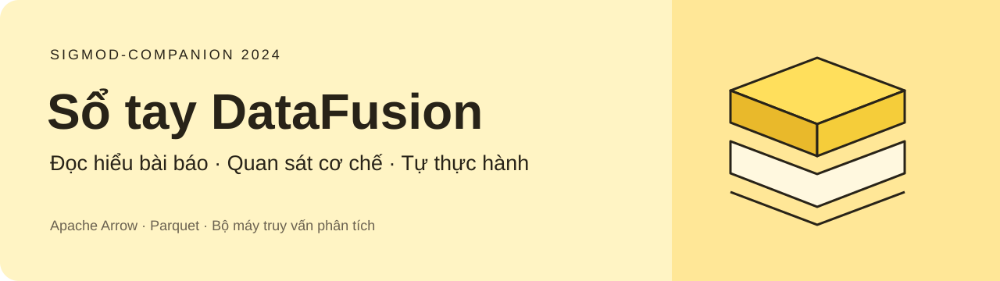
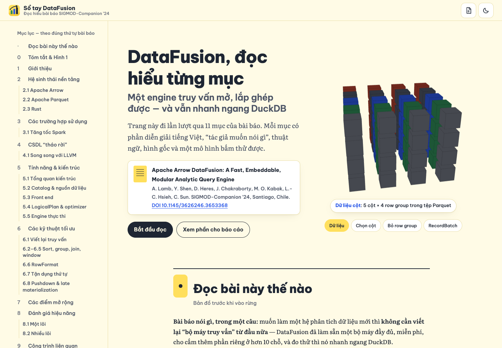
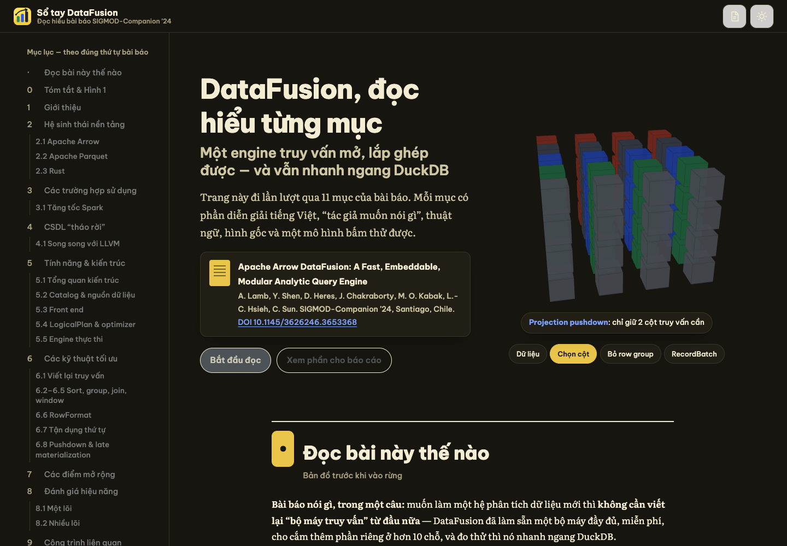
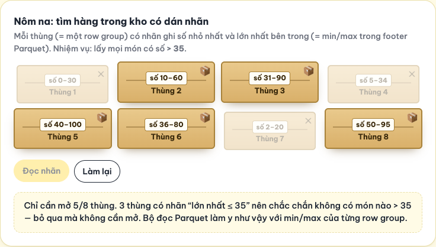
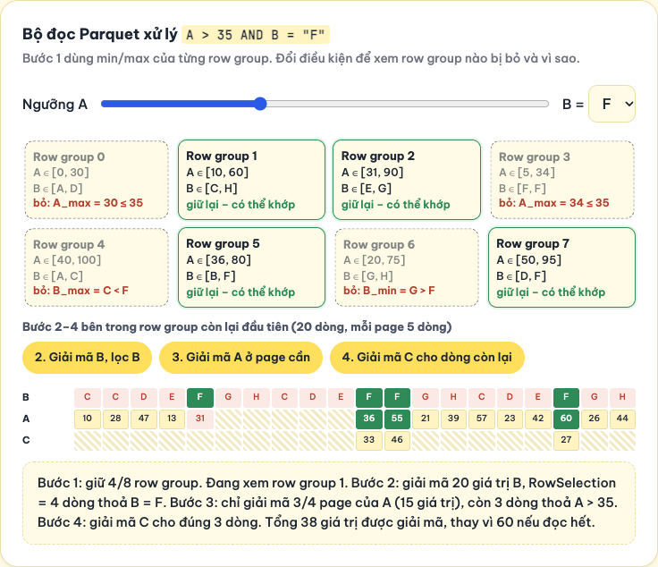
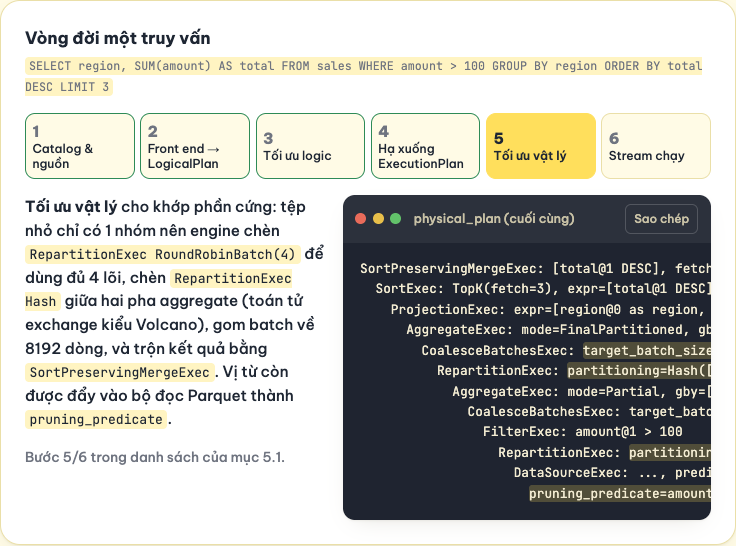
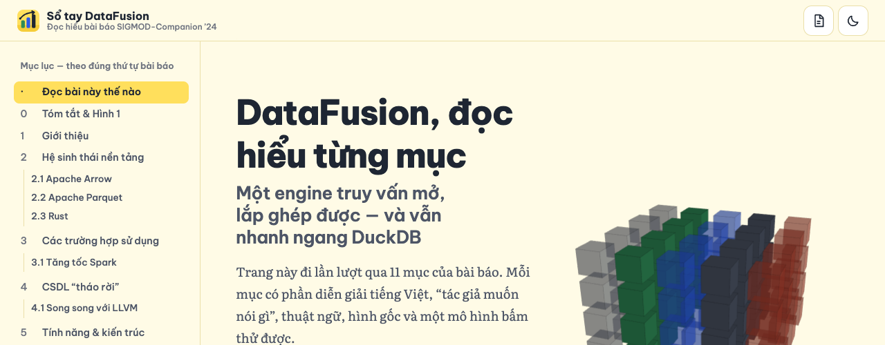
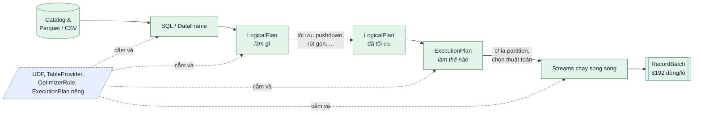

<p align="center">
  
</p>

<p align="center">
  <a href="https://doi.org/10.1145/3626246.3653368"></a>
  <a href="https://doi.org/10.1145/3626246.3653368"></a>
  <a href="https://datafusion.apache.org"></a>
  
</p>

<p align="center">
  <b>🇻🇳 Tiếng Việt</b> &nbsp;·&nbsp; <a href="#--english">🇬🇧 English</a>
</p>

---

## 🇻🇳 Tiếng Việt

### 📖 Đây là gì?

Bộ tài liệu **đọc hiểu bài báo** *Apache Arrow DataFusion: A Fast, Embeddable, Modular Analytic Query Engine* (Lamb et al., **SIGMOD-Companion ’24**), soạn cho môn **Hệ cơ sở dữ liệu tiên tiến**. Mục tiêu: ai đọc cũng hiểu bài báo nói gì, vì sao, và tự làm lại được phần minh hoạ.

### Mục đích và ghi nhận nguồn

Dự án phục vụ **học tập và nghiên cứu**, thông qua việc đọc hiểu, phân tích và thực hành các cơ chế được trình bày trong bài báo. Dự án không phải tài liệu chính thức của nhóm tác giả hay Apache DataFusion, không nhằm sao chép hoặc nhận các ý tưởng, thuật toán và kết quả của tác giả là đóng góp của người soạn.

Các hình, bảng và số liệu được trích để phân tích, có ghi nguồn bài báo. Phần diễn giải tiếng Việt, mô hình tương tác và hướng dẫn thực hành là nội dung bổ trợ do người soạn xây dựng; không thay thế bài báo gốc. Mô phỏng trên trang web không trực tiếp thực thi DataFusion. Kết quả thực hành phải được phân biệt với số liệu trong bài báo, ghi rõ phiên bản phần mềm, dữ liệu và điều kiện thí nghiệm. Việc ghi mục đích học tập không thay thế yêu cầu tuân thủ giấy phép và quyền sử dụng của từng nguồn.

> **Bài báo nói gì, trong một câu:** muốn làm một hệ phân tích dữ liệu mới thì **không cần viết lại “bộ máy truy vấn” từ đầu** — DataFusion là bộ máy mở, lắp ghép được, cho cắm thêm phần riêng ở hơn 10 chỗ, và đo thực nghiệm cho thấy nó **nhanh ngang DuckDB**.

### 🌐 Xem ngay

| | |
|---|---|
| **Trang web tương tác** | [`03-website/index.html`](03-website/index.html) — mở bằng trình duyệt là chạy, không cần cài gì |
| **Bản online** | `https://thang-uit.github.io/DataFusion-SIGMOD2024-Benchmark-Demo/` *(sau khi bật GitHub Pages — xem [cách bật](#--bật-bản-online-github-pages))* |
| **Bản đọc hiểu PDF** | [`01-reading-guide/DataFusion-ban-doc-hieu.pdf`](01-reading-guide/DataFusion-ban-doc-hieu.pdf) — đi đúng thứ tự từng mục của bài |
| **Giải thích chi tiết** | [`02-explainer/GIAI-THICH-BAI-BAO.md`](02-explainer/GIAI-THICH-BAI-BAO.md) — vấn đề, giải pháp, SOTA, phê phán, khung báo cáo |
| **Hướng dẫn tự code demo** | [`04-demo/README.md`](04-demo/README.md) — 8 bài demo, dữ liệu nhỏ, kết quả mong đợi, câu thầy có thể hỏi |

### 🖼️ Trang web trông như thế nào

<table>
  <tr>
    <td width="50%"><br><sub>Trang đầu: mô hình 3D dữ liệu cột (kéo để xoay)</sub></td>
    <td width="50%"><br><sub>Giao diện tối, tự theo hệ điều hành hoặc bấm đổi</sub></td>
  </tr>
  <tr>
    <td><br><sub>Nói nôm na: “kho hàng có dán nhãn” = bỏ qua row group nhờ min/max</sub></td>
    <td><br><sub>Đúng 4 bước của mục 6.8: bỏ row group → lọc → giải mã có chọn lọc</sub></td>
  </tr>
  <tr>
    <td><br><sub>Vòng đời một truy vấn, kèm output <code>EXPLAIN</code> chạy thật</sub></td>
    <td align="center"><br><sub>Responsive tới màn hình 320px</sub></td>
  </tr>
</table>

### 🧭 Bài báo trong 60 giây

| | |
|---|---|
| **What — vấn đề** | Xây một engine phân tích nhanh tốn rất nhiều tiền và người; mỗi hệ mới lại viết lại cùng một thứ (parser SQL, optimizer, join, đọc Parquet…). |
| **How — giải pháp** | Một engine dùng chung, chia sẵn tầng: front-end → `LogicalPlan` → tối ưu → `ExecutionPlan` → `Stream`. Tầng nào cũng chạy ngay được và cũng cắm thêm được qua API. |
| **Why — vì sao tin** | Nhiều hệ thật đang dùng (InfluxDB 3.0, Comet cho Spark, Delta Lake…). Benchmark ClickBench, TPC-H, H2O-G: ngang DuckDB khi chạy một lõi, và tăng tốc giống DuckDB khi thêm lõi. |



<details>
<summary><b>✨ Trang web có những gì?</b> (bấm để mở)</summary>

- Đi lần lượt **11 mục** của bài báo; mỗi chương mở đầu bằng ô **“Nói nôm na”** với ví dụ đời thường.
- 4 loại chú thích: *tác giả muốn nói gì*, *thuật ngữ*, *ví dụ*, *lưu ý*; kèm số trang của bài gốc để đối chiếu.
- **Hơn 20 mô hình tương tác:**
  - nhà máy truy vấn, tự xây và lắp ráp, Arrow là ngôn ngữ chung, lưu theo dòng và theo cột;
  - kiến trúc Hình 2, vòng đời truy vấn, kéo từng RecordBatch, đổi số partition;
  - MemoryPool Greedy và Fair, gom nhóm hai pha, bộ mã hoá RowFormat;
  - kho hàng có nhãn, pruning Parquet 4 bước, bảng ổ cắm mở rộng;
  - biểu đồ Bảng 1, đường cong mở rộng theo số lõi.
- Ảnh chụp đầy đủ các hình và bảng của bài (bấm để phóng to), tra thuật ngữ, 9 câu tự kiểm tra.
- Giao diện sáng/tối, responsive, đạt Lighthouse **Accessibility 100**. Hiệu ứng chỉ dùng `transform`/`opacity` và tự tắt khi bật *Reduce motion*.
- Không dùng thư viện ngoài: HTML + CSS + JavaScript thuần, chạy được cả khi offline.

</details>

### 🗂️ Cấu trúc thư mục

```
.
├── 00-paper/              Thông tin bài gốc + link DOI
├── 01-reading-guide/      Bản đọc hiểu từng mục (PDF A4) + nguồn HTML
├── 02-explainer/          Giải thích chi tiết + khung báo cáo 5–7 trang
├── 03-website/            Trang web đọc hiểu tương tác
│   └── assets/            css/ · js/ · img/ (logo, hình trích từ bài: PNG + WebP)
├── 04-demo/               Hướng dẫn tự code demo bằng Jupyter
├── tools/                 Script cắt hình từ PDF, build lại PDF đọc hiểu
├── .github/assets/        Banner + ảnh chụp màn hình cho README
└── index.html             Lối vào cho GitHub Pages (tự chuyển tới 03-website/)
```

### 🧪 Demo

Bài báo **không có demo ứng dụng**; mục 8 là thí nghiệm benchmark. Vì DataFusion là mã nguồn mở, mọi cơ chế trong bài đều **chạy thật** được với dữ liệu nhỏ, không cần 14 GB như bài. [`04-demo/README.md`](04-demo/README.md) hướng dẫn tự code 8 bài, mỗi bài gắn với một mục:

| Demo | Chứng minh | Mục |
|---|---|---|
| D1 · SQL và DataFrame | Hai cách viết cho cùng một kế hoạch | 5.3.3 |
| D2 · Vòng đời truy vấn | Pushdown, Top K, gom nhóm hai pha trong `EXPLAIN` | 5.1, 6.1–6.3 |
| D3 · Batch và partition | 8192 dòng/lô, song song hoá | 5.5 |
| D4 · Pruning Parquet | 8/10 row group bị bỏ khi dữ liệu đã sắp | 6.8 |
| D5 · Thứ tự sắp | Bỏ sort thừa, bộ nhớ giảm hơn trăm lần | 6.7 |
| D6 · Spill | Hết RAM thì ghi tạm ra đĩa | 5.5.4 |
| D7 · UDF | Hàm tự viết nhận cả lô Arrow | 7.1 |
| D8 · So với DuckDB | Mini benchmark TPC-H theo đúng phương pháp đo của tác giả | 8 |

```bash
cd 04-demo
python3 -m venv .venv && source .venv/bin/activate
pip install datafusion duckdb pyarrow pandas matplotlib jupyterlab
jupyter lab
```

### 🚀 Bật bản online (GitHub Pages)

1. Vào **Settings → Pages**.
2. Mục **Source** chọn *Deploy from a branch* → nhánh `main`, thư mục `/ (root)` → **Save**.
3. Sau khoảng 1 phút, trang có tại `https://thang-uit.github.io/DataFusion-SIGMOD2024-Benchmark-Demo/` (tệp `index.html` ở gốc tự chuyển vào `03-website/`).

### 📚 Trích dẫn bài báo

Đọc bài báo qua [DOI](https://doi.org/10.1145/3626246.3653368). Các khối “Chạy thật” trên trang web là kết quả của DataFusion 50.1 với dữ liệu tự sinh, không phải số liệu của bài báo.

```bibtex
@inproceedings{lamb2024datafusion,
  author    = {Lamb, Andrew and Shen, Yijie and Heres, Dani{\"e}l and Chakraborty, Jayjeet and
               Kabak, Mehmet Ozan and Hsieh, Liang-Chi and Sun, Chao},
  title     = {Apache Arrow DataFusion: A Fast, Embeddable, Modular Analytic Query Engine},
  booktitle = {Companion of the 2024 International Conference on Management of Data (SIGMOD-Companion '24)},
  year      = {2024},
  pages     = {5--17},
  publisher = {ACM},
  doi       = {10.1145/3626246.3653368}
}
```

---

## 🇬🇧 English

### 📖 What is this?

A **study companion** for the paper *Apache Arrow DataFusion: A Fast, Embeddable, Modular Analytic Query Engine* (Lamb et al., **SIGMOD-Companion ’24**), prepared for an *Advanced Database Systems* course (written in Vietnamese).

### Educational purpose and attribution

This project is for **learning and research** through reading, analysis and practical exploration of the paper. It is not an official publication of the paper's authors or Apache DataFusion and does not claim their ideas, algorithms or results as the preparer's own contributions.

Figures, tables and measurements are quoted for analysis with attribution. Vietnamese explanations, interactive models and practice guides are supplementary material, not a replacement for the original paper. Browser simulations do not execute DataFusion. Results from independent experiments must be distinguished from the paper's measurements and identify the software versions, data and experimental conditions. Educational intent does not replace applicable licences or permissions.

> **The paper in one sentence:** you no longer need to build a query engine from scratch to create a new data system — DataFusion is an open, modular engine with 10+ extension points, and experiments show it performs **on par with DuckDB**.

### 🌐 What's inside

| | |
|---|---|
| **Interactive website** | [`03-website/index.html`](03-website/index.html) — open it in any browser, no build step, works offline |
| **Online version** | `https://thang-uit.github.io/DataFusion-SIGMOD2024-Benchmark-Demo/` *(once GitHub Pages is enabled: Settings → Pages → `main` / root)* |
| **Reading guide (PDF)** | [`01-reading-guide/DataFusion-ban-doc-hieu.pdf`](01-reading-guide/DataFusion-ban-doc-hieu.pdf) — section-by-section annotated walkthrough |
| **Explainer** | [`02-explainer/GIAI-THICH-BAI-BAO.md`](02-explainer/GIAI-THICH-BAI-BAO.md) — problem, solution, state of the art, critique, report outline |
| **Demo guide** | [`04-demo/README.md`](04-demo/README.md) — 8 hands-on exercises with small data, expected results and likely examiner questions |

### ✨ Website highlights

- Follows the paper's **11 sections** in order. Each chapter opens with a plain-language “in everyday terms” box.
- **20+ interactive models.** Examples: the query “factory”, row vs column layout, Figure 2 architecture explorer, query lifecycle with real `EXPLAIN` output, pull-based RecordBatch flow, Greedy vs Fair memory pools, two-phase aggregation, RowFormat encoder, the “labelled warehouse” and 4-step Parquet pruning, and the Table 1 chart.
- Light/dark themes, responsive down to 320 px, Lighthouse **Accessibility 100**. Animations use only `transform`/`opacity` and respect *prefers-reduced-motion*.
- Zero dependencies: plain HTML, CSS and JavaScript.

### 🧪 Demo

The paper has no application demo; Section 8 is a benchmark study. Every mechanism it describes can be reproduced **for real** on small data. See the 8 exercises in [`04-demo/README.md`](04-demo/README.md) (SQL vs DataFrame, plan lifecycle, batches and partitions, Parquet pruning, sort-order exploitation, spilling, UDFs, and a mini TPC-H benchmark against DuckDB using the authors' measurement method).

### 📚 Paper citation

Read the paper via its [DOI](https://doi.org/10.1145/3626246.3653368) and cite it with the BibTeX entry above.

<p align="center"><sub>Made for learning · Không vì mục đích thương mại</sub></p>
