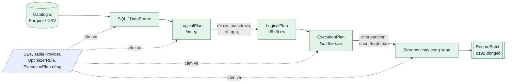

<p align="center">
  
</p>

<p align="center">
  <a href="https://doi.org/10.1145/3626246.3653368"></a>
  <a href="https://doi.org/10.1145/3626246.3653368"></a>
  <a href="https://datafusion.apache.org"></a>
  
</p>

<p align="center">
  <b>🇻🇳 Tiếng Việt</b> &nbsp;·&nbsp; <a href="#--english">🇬🇧 English</a>
</p>

---

## 🇻🇳 Tiếng Việt

### 📖 Đây là gì?

Bộ tài liệu **đọc hiểu bài báo** *Apache Arrow DataFusion: A Fast, Embeddable, Modular Analytic Query Engine* (Lamb et al., **SIGMOD-Companion ’24**), soạn cho môn **Hệ cơ sở dữ liệu tiên tiến**. Mục tiêu: ai đọc cũng hiểu bài báo nói gì, vì sao, và tự làm lại được phần minh hoạ.

### Mục đích và ghi nhận nguồn

Dự án phục vụ **học tập và nghiên cứu**, thông qua việc đọc hiểu, phân tích và thực hành các cơ chế được trình bày trong bài báo. Dự án không phải tài liệu chính thức của nhóm tác giả hay Apache DataFusion, không nhằm sao chép hoặc nhận các ý tưởng, thuật toán và kết quả của tác giả là đóng góp của người soạn.

Các hình, bảng và số liệu được trích để phân tích, có ghi nguồn bài báo. Phần diễn giải tiếng Việt, mô hình tương tác và hướng dẫn thực hành là nội dung bổ trợ do người soạn xây dựng; không thay thế bài báo gốc. Mô phỏng trên trang web không trực tiếp thực thi DataFusion. Kết quả thực hành phải được phân biệt với số liệu trong bài báo, ghi rõ phiên bản phần mềm, dữ liệu và điều kiện thí nghiệm. Việc ghi mục đích học tập không thay thế yêu cầu tuân thủ giấy phép và quyền sử dụng của từng nguồn.

> **Bài báo nói gì, trong một câu:** muốn làm một hệ phân tích dữ liệu mới thì **không cần viết lại “bộ máy truy vấn” từ đầu** — DataFusion là bộ máy mở, lắp ghép được, cho cắm thêm phần riêng ở hơn 10 chỗ, và đo thực nghiệm cho thấy nó **nhanh ngang DuckDB**.

### 🌐 Xem ngay

| | |
|---|---|
| **Trang web tương tác** | [`03-website/index.html`](03-website/index.html) — mở bằng trình duyệt là chạy, không cần cài gì |
| **Bản online** | `https://thang-uit.github.io/DataFusion-SIGMOD2024-Benchmark-Demo/` *(sau khi bật GitHub Pages — xem [cách bật](#--bật-bản-online-github-pages))* |
| **Video giải thích Q8** | Đã nhúng ngay trong mục ClickBench Q8 của trang web; tệp MP4 nằm tại [`03-website/assets/video/clickbench-q8-datafusion-parquet.mp4`](03-website/assets/video/clickbench-q8-datafusion-parquet.mp4) |
| **Bản đọc hiểu PDF** | [`01-reading-guide/DataFusion-ban-doc-hieu.pdf`](01-reading-guide/DataFusion-ban-doc-hieu.pdf) — đi đúng thứ tự từng mục của bài |
| **Giải thích chi tiết** | [`02-explainer/GIAI-THICH-BAI-BAO.md`](02-explainer/GIAI-THICH-BAI-BAO.md) — vấn đề, giải pháp, SOTA, phê phán, khung báo cáo |
| **Hướng dẫn tự thực hành** | [`04-demo/README.md`](04-demo/README.md) — notebook chỉ có hướng dẫn và ô mã trống, dùng Homebrew Python 3.13.15; không có lời giải sẵn |

### 🖼️ Trang web trông như thế nào

<table>
  <tr>
    <td width="50%"><br><sub>Trang đầu: mô hình 3D dữ liệu cột (kéo để xoay)</sub></td>
    <td width="50%"><br><sub>Giao diện tối, tự theo hệ điều hành hoặc bấm đổi</sub></td>
  </tr>
  <tr>
    <td><br><sub>Nói nôm na: “kho hàng có dán nhãn” = bỏ qua row group nhờ min/max</sub></td>
    <td><br><sub>Đúng 4 bước của mục 6.8: bỏ row group → lọc → giải mã có chọn lọc</sub></td>
  </tr>
  <tr>
    <td><br><sub>Vòng đời một truy vấn, kèm output <code>EXPLAIN</code> chạy thật</sub></td>
    <td align="center"><br><sub>Responsive tới màn hình 320px</sub></td>
  </tr>
</table>

### 🧭 Bài báo trong 60 giây

| | |
|---|---|
| **What — vấn đề** | Xây một engine phân tích nhanh tốn rất nhiều tiền và người; mỗi hệ mới lại viết lại cùng một thứ (parser SQL, optimizer, join, đọc Parquet…). |
| **How — giải pháp** | Một engine dùng chung, chia sẵn tầng: front-end → `LogicalPlan` → tối ưu → `ExecutionPlan` → `Stream`. Tầng nào cũng chạy ngay được và cũng cắm thêm được qua API. |
| **Why — vì sao tin** | Nhiều hệ thật đang dùng (InfluxDB 3.0, Comet cho Spark, Delta Lake…). Benchmark ClickBench, TPC-H, H2O-G: ngang DuckDB khi chạy một lõi, và tăng tốc giống DuckDB khi thêm lõi. |



<details>
<summary><b>✨ Trang web có những gì?</b> (bấm để mở)</summary>

- Đi lần lượt **11 mục** của bài báo; mỗi chương mở đầu bằng ô **“Nói nôm na”** với ví dụ đời thường.
- 4 loại chú thích: *tác giả muốn nói gì*, *thuật ngữ*, *ví dụ*, *lưu ý*; kèm số trang của bài gốc để đối chiếu.
- **Hơn 20 mô hình tương tác:**
  - nhà máy truy vấn, tự xây và lắp ráp, Arrow là ngôn ngữ chung, lưu theo dòng và theo cột;
  - kiến trúc Hình 2, vòng đời truy vấn, kéo từng RecordBatch, đổi số partition;
  - MemoryPool Greedy và Fair, gom nhóm hai pha, bộ mã hoá RowFormat;
  - kho hàng có nhãn, pruning Parquet 4 bước, bảng ổ cắm mở rộng;
  - biểu đồ Bảng 1, đường cong mở rộng theo số lõi.
- Ảnh chụp đầy đủ các hình và bảng của bài (bấm để phóng to), tra thuật ngữ, 9 câu tự kiểm tra.
- Giao diện sáng/tối, responsive, đạt Lighthouse **Accessibility 100**. Hiệu ứng chỉ dùng `transform`/`opacity` và tự tắt khi bật *Reduce motion*.
- **Video ClickBench Q8 có thuyết minh** được nhúng trực tiếp trên web, giải thích điều kiện truy vấn, thống kê Parquet, lô dữ liệu Arrow và giới hạn của kết luận trong bài báo.
- Không dùng thư viện ngoài: HTML + CSS + JavaScript thuần, chạy được cả khi offline.

</details>

### 🗂️ Cấu trúc thư mục

```
.
├── 00-paper/              Thông tin bài gốc + link DOI
├── 01-reading-guide/      Bản đọc hiểu từng mục (PDF A4) + nguồn HTML
├── 02-explainer/          Giải thích chi tiết + khung báo cáo 5–7 trang
├── 03-website/            Trang web đọc hiểu tương tác
│   └── assets/            css/ · js/ · img/ · video/ (video giải thích ClickBench Q8)
├── 04-demo/               Hướng dẫn + notebook trống để tự viết D1–D8
├── video-q6-preview/      Mã nguồn HyperFrames và lời đọc để dựng lại video Q8
├── tools/                 Script cắt hình từ PDF, build lại PDF đọc hiểu
├── .github/assets/        Banner + ảnh chụp màn hình cho README
└── index.html             Lối vào cho GitHub Pages (tự chuyển tới 03-website/)
```

### 🧪 Demo

Bài báo có đoạn Rust minh họa ở Hình 3 và dẫn đến mã thí nghiệm đo hiệu năng tại mục 8, nhưng không cung cấp notebook hướng dẫn D1–D8 này. [`04-demo/README.md`](04-demo/README.md) hướng dẫn tự viết mã trong notebook có ô trống, không có chương trình làm sẵn. Khi dùng thư viện DataFusion để chạy truy vấn, đó là thực nghiệm thật; hoạt ảnh trên trang HTML chỉ là mô phỏng giải thích. Dữ liệu nhỏ không tái lập kết luận hiệu năng ở quy mô của bài báo. Mỗi phần thực hành gắn với một mục:

| Demo | Chứng minh | Mục |
|---|---|---|
| D1 · SQL và DataFrame | Hai cách viết cho cùng một kế hoạch | 5.3.3 |
| D2 · Vòng đời truy vấn | Pushdown, Top K, gom nhóm hai pha trong `EXPLAIN` | 5.1, 6.1–6.3 |
| D3 · Batch và partition | 8192 dòng/lô, song song hoá | 5.5 |
| D4 · Pruning Parquet | So số nhóm dòng bị bỏ với dữ liệu đã sắp và xáo trộn | 6.8 |
| D5 · Thứ tự sắp | Kiểm tra loại bỏ sắp xếp thừa và lượng bộ nhớ gom nhóm | 6.7 |
| D6 · Spill | Hết RAM thì ghi tạm ra đĩa | 5.5.4 |
| D7 · UDF | Hàm tự viết nhận cả lô Arrow | 7.1 |
| D8 · So với DuckDB | Thí nghiệm TPC-H nhỏ, đối chiếu giá trị trước khi so thời gian | 8 |

```bash
cd 04-demo
/opt/homebrew/bin/python3.13 -m venv .venv
.venv/bin/python -m pip install -r requirements.txt
.venv/bin/python -m ipykernel install --prefix .venv --name datafusion-py313 --display-name "DataFusion · Python 3.13.15"
.venv/bin/python -m jupyterlab DataFusion_TuThucHanh.ipynb --ip=127.0.0.1
```

### 🚀 Đưa trang lên mạng bằng GitHub Pages

GitHub Pages sẽ xuất bản các tệp tĩnh trong nhánh đã chọn. Kho mã này đã có `index.html` ở thư mục gốc; tệp đó tự chuyển người đọc đến `03-website/`. Video Q8 được lưu trong kho và phát trực tiếp từ thư mục tài sản của trang, nên không cần máy chủ video riêng.

1. Mở kho mã trên GitHub, vào **Settings → Pages**.
2. Ở **Build and deployment**, chọn **Deploy from a branch**.
3. Chọn nhánh **`main`** và thư mục **`/ (root)`**, sau đó nhấn **Save**.
4. Mở thẻ **Actions** để theo dõi tác vụ xuất bản. Khi tác vụ Pages hoàn tất, trang có tại [`https://thang-uit.github.io/DataFusion-SIGMOD2024-Benchmark-Demo/`](https://thang-uit.github.io/DataFusion-SIGMOD2024-Benchmark-Demo/). Lần xuất bản đầu có thể mất vài phút.
5. Nếu vừa push commit mới, chờ tác vụ Pages của commit đó hoàn tất rồi tải lại trang. Khi trình duyệt còn giữ bản cũ, tải lại mạnh hoặc mở cửa sổ riêng tư để kiểm tra.

Nếu GitHub không cho chọn nhánh `main`, hãy bảo đảm commit đã được push lên GitHub và có tệp `index.html` tại thư mục gốc; sau đó tải lại trang **Settings → Pages**.

### 📚 Trích dẫn bài báo

Đọc bài báo qua [DOI](https://doi.org/10.1145/3626246.3653368). Các khối “Chạy thật” trên trang web là kết quả của DataFusion 50.1 với dữ liệu tự sinh, không phải số liệu của bài báo.

```bibtex
@inproceedings{lamb2024datafusion,
  author    = {Lamb, Andrew and Shen, Yijie and Heres, Dani{\"e}l and Chakraborty, Jayjeet and
               Kabak, Mehmet Ozan and Hsieh, Liang-Chi and Sun, Chao},
  title     = {Apache Arrow DataFusion: A Fast, Embeddable, Modular Analytic Query Engine},
  booktitle = {Companion of the 2024 International Conference on Management of Data (SIGMOD-Companion '24)},
  year      = {2024},
  pages     = {5--17},
  publisher = {ACM},
  doi       = {10.1145/3626246.3653368}
}
```

---

## 🇬🇧 English

### 📖 What is this?

A **study companion** for the paper *Apache Arrow DataFusion: A Fast, Embeddable, Modular Analytic Query Engine* (Lamb et al., **SIGMOD-Companion ’24**), prepared for an *Advanced Database Systems* course (written in Vietnamese).

### Educational purpose and attribution

This project is for **learning and research** through reading, analysis and practical exploration of the paper. It is not an official publication of the paper's authors or Apache DataFusion and does not claim their ideas, algorithms or results as the preparer's own contributions.

Figures, tables and measurements are quoted for analysis with attribution. Vietnamese explanations, interactive models and practice guides are supplementary material, not a replacement for the original paper. Browser simulations do not execute DataFusion. Results from independent experiments must be distinguished from the paper's measurements and identify the software versions, data and experimental conditions. Educational intent does not replace applicable licences or permissions.

> **The paper in one sentence:** you no longer need to build a query engine from scratch to create a new data system — DataFusion is an open, modular engine with 10+ extension points, and experiments show it performs **on par with DuckDB**.

### 🌐 What's inside

| | |
|---|---|
| **Interactive website** | [`03-website/index.html`](03-website/index.html) — open it in any browser, no build step, works offline |
| **Online version** | `https://thang-uit.github.io/DataFusion-SIGMOD2024-Benchmark-Demo/` *(once GitHub Pages is enabled: Settings → Pages → `main` / root)* |
| **Q8 explainer video** | Embedded in the ClickBench Q8 section; MP4 source: [`03-website/assets/video/clickbench-q8-datafusion-parquet.mp4`](03-website/assets/video/clickbench-q8-datafusion-parquet.mp4) |
| **Reading guide (PDF)** | [`01-reading-guide/DataFusion-ban-doc-hieu.pdf`](01-reading-guide/DataFusion-ban-doc-hieu.pdf) — section-by-section annotated walkthrough |
| **Explainer** | [`02-explainer/GIAI-THICH-BAI-BAO.md`](02-explainer/GIAI-THICH-BAI-BAO.md) — problem, solution, state of the art, critique, report outline |
| **Demo guide** | [`04-demo/README.md`](04-demo/README.md) — guided Jupyter notebooks with blank code cells, configured for Homebrew Python 3.13.15 |

### ✨ Website highlights

- Follows the paper's **11 sections** in order. Each chapter opens with a plain-language “in everyday terms” box.
- **20+ interactive models.** Examples: the query “factory”, row vs column layout, Figure 2 architecture explorer, query lifecycle with real `EXPLAIN` output, pull-based RecordBatch flow, Greedy vs Fair memory pools, two-phase aggregation, RowFormat encoder, the “labelled warehouse” and 4-step Parquet pruning, and the Table 1 chart.
- Light/dark themes, responsive down to 320 px, Lighthouse **Accessibility 100**. Animations use only `transform`/`opacity` and respect *prefers-reduced-motion*.
- A narrated ClickBench Q8 explainer video is embedded on the page and committed under `03-website/assets/video/`.
- Zero dependencies: plain HTML, CSS and JavaScript.

### 🌐 Publish with GitHub Pages

1. Open the repository's **Settings → Pages**.
2. Under **Build and deployment**, choose **Deploy from a branch**.
3. Select branch **`main`** and folder **`/ (root)`**, then click **Save**.
4. Follow the deployment job under **Actions**. Once it completes, the site is available at [`https://thang-uit.github.io/DataFusion-SIGMOD2024-Benchmark-Demo/`](https://thang-uit.github.io/DataFusion-SIGMOD2024-Benchmark-Demo/).

The root `index.html` redirects visitors to `03-website/`. The Q8 MP4 is committed with the site and plays directly from its assets folder; no separate video host is required. The initial deployment may take a few minutes. After a new push, wait for the Pages job to finish and hard-refresh the browser if it still shows a cached version.

### 🧪 Demo

The paper includes a Rust illustration in Figure 3 and links to benchmark scripts in Section 8. [`04-demo/README.md`](04-demo/README.md) provides guided Jupyter notebooks with instructions and empty code cells, configured for Homebrew Python 3.13.15 on macOS ARM64. There are no prewritten solutions. Code written using DataFusion runs the real engine; the HTML animations are explanatory simulations. Small-data experiments do not reproduce the paper's full benchmark setup or performance conclusions.

### 📚 Paper citation

Read the paper via its [DOI](https://doi.org/10.1145/3626246.3653368) and cite it with the BibTeX entry above.

<p align="center"><sub>Made for learning · Không vì mục đích thương mại</sub></p>
